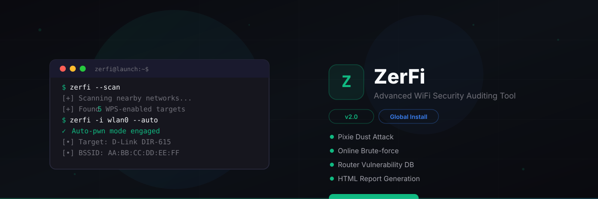

<div align="center">



**ZerFi v2.0** — WPS Security Auditing Tool for Android / Termux

[](https://github.com/ZeronModz/ZerFi/releases)
[](https://termux.dev)
[](LICENSE)
[](https://github.com/ZeronModz/ZerFi)
[](https://zerfi.vercel.app)

</div>

---

## 📌 Overview

ZerFi is a **WPS (Wi-Fi Protected Setup) security auditing tool** built for Android devices running Termux. It automates Pixie Dust and Bruteforce attacks against WPS-enabled routers, allowing security researchers and network administrators to evaluate the strength of their own wireless infrastructure.

ZerFi v2.0 is a complete rewrite with a global command system, session management, reporting, improved stability, and a built-in interactive help guide — all optimized for Android / Termux.

> **⚠️ For authorized testing only. Only use on networks you own or have permission to test.**

---

## 📋 Requirements

| Requirement | Details |
|---|---|
| **Device** | Android (rooted with Magisk or KernelSU) |
| **Terminal** | [Termux](https://termux.dev) from F-Droid |
| **Root** | Working `su` binary (Magisk recommended) |
| **WiFi** | Internal wlan0 or external USB adapter |

---

## 🚀 One-Click Install

Copy and paste this single command in Termux:

```bash
curl -sLo installer.sh https://raw.githubusercontent.com/ZeronModz/ZerFi/main/installer.sh && bash installer.sh
```

This will:
1. Update all Termux packages
2. Install required packages (`python`, `wpa-supplicant`, `pixiewps`, `iw`, etc.)
3. Clone ZerFi from GitHub
4. Install Python dependencies
5. Register the `zerfi` global command in `$PREFIX/bin`

After installation, type `zerfi` to start.

---

## 📦 Manual Installation

If you prefer to install step by step:

```bash
# 1. Update Termux
pkg update && pkg upgrade -y

# 2. Install dependencies
pkg install root-repo -y
pkg install git tsu python wpa-supplicant pixiewps iw -y

# 3. Clone ZerFi
git clone https://github.com/ZeronModz/ZerFi
cd ZerFi

# 4. Install Python dependencies
pip install -r requirements.txt --break-system-packages

# 5. Run local setup
chmod +x install.sh
bash install.sh
```

---

## 🔧 Available Commands

After installation, the `zerfi` command is available globally:

| Command | Description |
|---|---|
| `zerfi` | Run with defaults (wlan0 + Pixie Dust) |
| `zerfi menu` | Open interactive menu (no auto-attack) |
| `zerfi old` | Run legacy engine (w1.py) |
| `zerfi update` | Pull latest updates from GitHub |
| `zerfi help` | Open interactive help guide |
| `zerfi fix` | Fix root/superuser issues |
| `zerfi contact` | Contact developer |

---

## 🎯 Usage Examples

**Quick scan + attack:**
```bash
zerfi
```

**Pixie Dust on a specific router:**
```bash
zerfi -i wlan0 -b AA:BB:CC:DD:EE:FF -K
```

**Bruteforce on a specific router:**
```bash
zerfi -i wlan0 -b AA:BB:CC:DD:EE:FF -B
```

**Pixie Dust without touching Android WiFi settings:**
```bash
zerfi -i wlan0 -K --dts
```

**Scan, select network, then attack:**
```bash
zerfi -i wlan0 -K
```

**View saved sessions:**
```bash
zerfi --list-sessions
```

**Resume a previous session:**
```bash
zerfi -i wlan0 --resume-session AA:BB:CC:DD:EE:FF
```

**Generate HTML report:**
```bash
zerfi -i wlan0 -b AA:BB:CC:DD:EE:FF -K --html-report
```

**Slow bruteforce (avoid lockout):**
```bash
zerfi -i wlan0 -b AA:BB:CC:DD:EE:FF -B -d 3
```

**Full argument reference:** Run `zerfi help` and select option 5.

---

## 🎨 Features

### Attack Modes
- **Pixie Dust** (`-K`) — Fast offline PIN extraction
- **Bruteforce** (`-B`) — Try all PINs (up to 11000)
- **Push Button Connect** (`--pbc`) — WPS button mode
- **Smart Auto Scan** — Scan once, attack all vulnerable networks

### Session Management
- Save and resume attacks (`--resume-session`)
- View all saved sessions (`--list-sessions`)
- Auto-reset attacked networks (`--auto-reset`)

### Reporting
- HTML report generation (`--html-report`)
- CSV / JSON / TXT output
- Detailed or summary mode

### Security Analysis
- Signal strength analysis before attack (`--signal-analysis`)
- Vulnerability check (`--check-vuln`)
- Weak WPS algorithm detection (`--detect-weak-algo`)
- Pixie Dust vulnerable router list (`--pixie-list`)

### Android-Specific
- `--dts` — Don't touch Android WiFi settings
- `--mtk-wifi` — MediaTek WiFi driver support
- `--handle-rfkill` — Auto-unblock rfkill
- `--iface-down` — Bring interface down after exit

---

## 🔍 How It Works

ZerFi uses `wpa_supplicant` to communicate with WPS-enabled routers:

1. **Scan** — Discovers nearby WPS networks using `iw` scan
2. **Analyze** — Identifies router model, checks vulnerability databases
3. **Attack** — Runs Pixie Dust (fast) or Bruteforce (thorough)
4. **Extract** — Captures WPS PIN and WPA PSK
5. **Save** — Stores results locally with session tracking
6. **Report** — Generates HTML/CSV/JSON reports

---

## 🛠 Troubleshooting

| Problem | Fix |
|---|---|
| "Run it as root" | Run `zerfi fix` first |
| "No superuser binary detected" | `zerfi fix` or use [fix-termux-root](https://github.com/ZeronModz/fix-termux-root) |
| "Unable to up interface" | Check name with `ip link show` |
| wpa_supplicant crash | `pkill wpa_supplicant` then retry |
| No WPS networks found | Disable Location/GPS, toggle WiFi |
| Router keeps locking | Add `-d 3` or use `--lock-delay 120` |
| WiFi rfkill blocked | Use `--handle-rfkill` or `rfkill unblock wifi` |
| Pixie Dust not working | Router not vulnerable → use `-B` (bruteforce) |
| "Address already in use" | Previous socket file — auto-cleaned on restart |
| After Ctrl+C glitch | Auto-cleanup handles terminal + processes |

---

## 📄 Changelog

See [CHANGELOG.md](CHANGELOG.md) for the full version history.

---

## ⚠️ Disclaimer

ZerFi is provided for **educational and authorized penetration testing purposes only**. You are solely responsible for ensuring you have permission to test any network. The author is **not liable** for any misuse, damage, or legal consequences.

---

## 👤 Author

**DevZeron (Hasan)**

| Platform | Link |
|---|---|
| GitHub | [ZeronModz](https://github.com/ZeronModz) |
| Telegram | [@DevZeron](https://t.me/DevZeron) |
| Telegram Channel | [@DevZeron](https://t.me/DevZeron) |

Honorable mentions: rofl0r, Rayhan, Alamin, Sojib, Sanji, Mustakin, Sakib, rizzi

---

<div align="center">
⭐ If ZerFi has been useful, consider leaving a star on GitHub — it helps the project grow.
</div>
